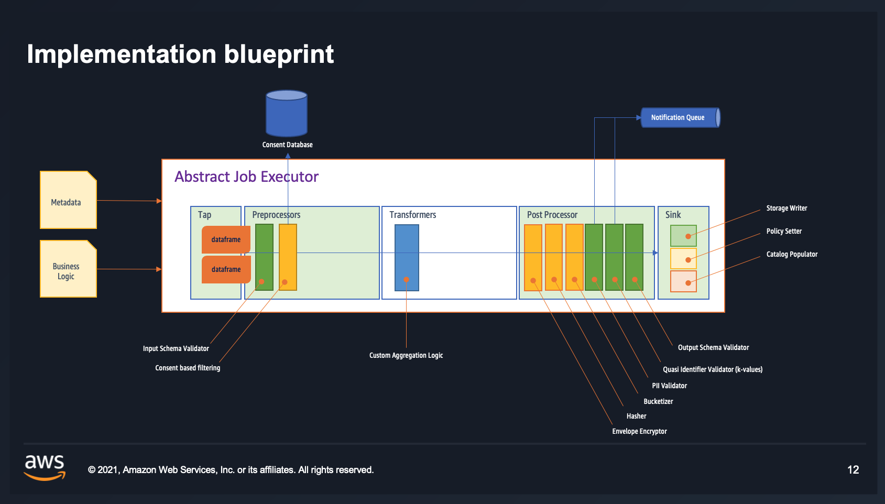

# Data Product Processor

Library for dynamically creating and executing ETL Jobs based on a declarative description of a data product.

The processor will is executed as Spark job based on a data product definitions (Yaml files and custom spark code),
generating one or more output data assets.

## Why is this an interesting project?

### Integration into Glue:

- Script location - the location of the main.py
- Python lib path - the location of the wheel package of this project (eg. data-product-processor-version-py3.whl)
- Other lib path - the reference to the zipped data product definition (eg. s3:
  //data-products/product_a_customers-1.0.0.zip)
- Temporary directory - an arbitrary S3 bucket for temporary files
- Job parameters - Glue job parameters, including the dependencies of this libraryr (eg. --additional-python-modules
  pydantic,quinn,pyyaml,mypy-boto3-glue)

## Architecture



# Data Product

Each data-product consists of a mandatory ```product.yml``` and ```model.yml``` files and an optional ```task```
folder that hold the custom aggregation logic of the data products.

- the ```product.yaml``` describes the overall data products and the aggregation pipeline;
- the ```model.yaml``` describes the datasets that are being consumed and produced within the data product;

## Product Schema

The ```product.yml``` defines the transformation pipeline, consisting one or more tasks, each having one or more inputs
and outputs. Additionally, it provides some directives regarding the execution engines (eg. Glue, EMR, etc.) and other
details around the execution.

```yaml
schema_version: 1.rc-1
product:
  id: customers_personal_data
  description: All customer data
  version: "1.0.0"
  defaults:
    ...
  owner: jane.doe@acme.com
  engine: glue | emr | dbt
  pipeline:
    schedule: "0 */1 * * *"
    tasks:
      - id: extract customer data
        logic:
          module: tasks.custom_business_logic
          parameters:
            create_timestamp: true
        inputs:
          - connection: test_db_connection
            table: sportstickets.person_relevant
        outputs:
          - model: person_pii
          - model: person_pub
```

- **schema_version**: the schema version against this yaml file will be validated;
- product: the data product details;
- **product.id**: the identification of this product, that is unique across the whole organisation (or at least across
  one data platform);
- **product.name**: [optional] a more human-readable ID of the data product;
- **product.description**: the detailed description of the data-product (data catalogs and other metadata stores will be
  populated with this information;
- **product.version**: the current version of this data-product. If a schema of one model is changed, the data-product
  version should be changed as well;
- **product.defaults**: [optional] default values (eg. for dataset storage location), used when not explicitly stated on
  the model;
- **product.owner**: the e-mail address of the data product owner who will get notified upon failures;
- **product.engine**: the execution engine of this data products (like Glue or EMR);
- **product.pipeline**: contains scheduling information and the list of transformation tasks;
- **pipeline.schedule**: the cron expression for scheduling the trigger of this job;
- **pipeline.tasks**: the list of tasks to be executed to produce the final version of this data-product;
- **task.id**: the identification of this task, that is unique within the same data product;
- **task.logic**: [optional] the custom transformation logic of this task. If not specified, the processor will fall
  back to buil-in ingest task with pass-through logic (that brings no additional transformation to the ones defined in
  the model.
- **task.logic.module**: defines the module that contains the custom aggregation logic and has an execute method;
- **task.logic.parameters**: custom parameters used by the aggregation logic;
- **task.inputs**: list of IO handlers (be it connection to a database or a dataset in the data-lake represented by a
  model);
- **task.outputs**: list of IO handlers (be it connection to a database or a dataset in the data-lake represented by a
  model);

The ``logic`` keyword and all of its parameters can be omitted. In that case the ```builtin.ingest``` logic is being
used by default. This is useful when you want to ingest tables, but you don't need to make any custom transformation
beyond the once provided on the model object.

The builtin ```ingest``` module can also take parameters, such as create_timestamp (false by default). If this is
specified a new column is added with the ingestion timestamp.

```yaml
    tasks:
      - id: process_some_files
        logic:
          module: builtin.ingest
          parameters:
            create_timestamp: true

```

### IO Handlers:

```yaml
inputs:
  - connection: test_db_connection
      table: sportstickets.person_relevant
      model: person_pii
outputs:
  - model: person_pii
  - model: person_pub
```

In this case the input is a database, the output is two datasets represented by two models. The IO handlers are of two
types:

- connection: is a connection to an external resources, such as RDBMS (eg. PostgreSQL), where the connection details are
  listed in the Glue connection list;
- model: is a reference to a dataset in the data-lake and with the exact location specified in the data-catalog;

Both IO-handler types can be used as input and output.

- **connection**: defines that this is an IO-handler of connection type and provides the ID of the connection that
  should looked-up in the Glue Connection store;
- **connection.table**: defines the source or destination table-name with the optional schema prefix;
- **connection.model**: [optional] used for schema validation and built-in transformations defined in model structures;
- **model**: defines that this is an IO-handler of Model (data-set in a data-lake) type and provides the ID of the
  data-set in the data lake, that is stored in the Glue data-catalog;

### Defaults

Some default configuration options can be added to the data product. These can be used, when there's no other value
overriding them on the Models (read later). The following defaults are supported:

```yaml
  defaults:
    storage:
      location: some_bucket/some_folder
      options:
        compression: uncompressed | snappy | gzip | lzo | brotli | lz4
        coalesce: 2
```

Check the meaning of the various parameters on the ```model.storage``` property down bellow;

## Model Schema

The ```model.yaml``` enlists the details of all input (optional) and output (mandatory) models. The model contains
information about the 1.) schema types and validation, 2.) storage location and access controls and 3.) directives for
transformation.

The core structure is the following:

```yaml
schema_version: 1.rc-1
models:
  - id: person
    version: "1.0"
    description: "Person Model"
    extends: other_model
    validation: strict | lazy
    xtra_columns: raze | ignore
    columns:
      - ...
      - ...
      - ...
    meta:
      contains_pii: true
      steward: jane.doe@acme.com
    storage:
      location: '/some_data_lake/some_folder'
      type: lake
      format: parquet
    tags:
      cost_center: 123455
      use_case: Customer 360
    access:
      domain: customer_support
      confidentiality: private
```

These are the keywords:

- schema_version: it is the reference for the version of the model schema, against this yaml is being validated
- models: contains a list of input and ouput models
- model.id: an identification string that is unique within this dataproduct. In most places the model (dataset) will be
  referenced as ```product_id.model_id```; This documentation used the ```model``` and ```dataset```  keywords somewhat
  interchangebly. Model refers mostly to the metadata that describes a dataset.
- model.version: defines the version of this model. Once the model was published, the version should be changed at each
  schema change;
- description: human readable description of a model that gets registered in the data catalog as well;
- name: [optional] human readable name of the model, similar in use to the id;
- extends: [optional] it is a directive that helps to inherit column definitions from another model, therefore it makes
  it easier to define derived models, that only override or extend one or more columns;
- validation: [optional] the default value is lazy validation (even if the keyword "validation" is omitted). Lazy
  validation will only check the type of the columns that are stated in the model, but will accept extra columns (that
  are available on the Data Frame but not defined in the model). A strict validation will raise an exception if the Data
  Frame has more columns than stated in the Model;
- xtra_columns: [optional] if omitted, it will ignore the existence of extra columns on the Data Frame. If defined with
  the value **raze**, it will remove any columns from the Data Frame that are not specified on the Model;
- columns: a list of columns, stating data types, constraint validators and column transformers;
- meta: [optional] a list of key-value pairs that are added to the data catalog as meta data;
- storage: [optional] a definition about the location (and compression, file format, etc.) of the output dataset;
- tags: [optional] a set of key-value pairs that are assigned to the output data-set and can help later with the
  governance (eg cost control);
- access: provides a list of key-value tags that will govern access to the output data-sets;

### Storage

The storage directive defines how to store model data:

```yaml
    storage:
      type: lake | file
      location: 'some_bucket/some_file'
      format: parquet | csv
      options:
        skip_first_row: true | false
        partition_by:
          - gender
          - age
        compression: uncompressed | snappy | gzip | lzo | brotli | lz4
        coalesce: 2
        bucketed_at: 512M <-- not yet supported
```

- type: the default type is 'lake' as in Data Lake. This will write the dataset onto S3 and register the dataset with
  the Glue Data Catalog;
- location: a specific location for the model; If ommited the location set on the prouct will be taken into account.
- format: the file format used to writing out data;
- options: [optional] a set of options specifiend details for the write out
- options.skip_first_row: will not write out the first row
- options.partition_by: list of columns used for partitioning the parquet file;
- compression: the algorithm used by the parquet file (default is snappy);
- coalesce: the number of file for each partition (the more you have, the more parallel reads are possible but not
  recommended for small files). The default is 2.
- bucketed_at: defines the file-chunk sized to be written (the more )

Location resolution: the output file location is first looked up on the model's ```storage.location``` property. If not
found, it will look on the product's ```defaults.storage``` options, and ultimately will check
the ```--default_data_lake_bucket```
command line parameter.

### Columns

Every model defines one or more columns that are used for schema and constraint validation, and for built-in
transformations.

```yaml
columns:
  - id: id
    type: integer
    constraints:
      - type: unique
  - id: full_name
    type: string
    transform:
      - type: encrypt
  - id: gender
    type: string
    constraints:
      - type: not_null
      - type: regexp
        options:
          value: '^Male|Female$'
```

The definition of the column object:

- **id**: the id of the column which is unique within the model (and coincides with the column name);
- **type**: the data type of the column (eg. string, integer, boolean, etc.);
- **constraints**: the list of constraints that apply for this column;
- **constraints.type**: one constraint object for this column (eg. unique, not null, etc.);
- **transform**: the list of transforms that apply to this column;
- **transform.type**: the transform object type;

### Constraint Validators

#### Unique Constraint Validator

This constraint takes no parameters and assures that the columns has distinct values, that are unique within the column.

Example:

```yaml
- id: id
  type: integer
  constraints:
    - type: unique
```

#### Regexp Constraint Validator

This constraint assures that all values in a column match a particular regular expression, provided within
the ```value``` keyword. It can be used for e-mail validation or strict option list validation and alike.

Example:

```yaml
- id: gender
  type: string
  constraints:
    - type: not_null
    - type: regexp
      options:
        value: '^Male|Female$'
```

#### Past Constraint Validator

It applies to date/timestamp columns, an assures that all values are in the past. If the optional ```threshold``` value
is not defined, it will compare every row against the ```datetime.now()```. When the ```threshold``` option is defined,
column values are compared against ```now()+timedelta(threshold)```, so values that are in the near future (defined by
the threshold) are accepted too.

Example:

```yaml
- id: transaction_date
  type: timestamp
  constraints:
    - type: past
      options:
        threshold: 10
        time_unit: minutes
```

Accepted time units: seconds, minutes, hours, days, weeks;

#### Future Constraint Validator

Similarly to the Pas validator, it checks that all the values in a date/timestamp column are in the future. If the
optional ```threshold``` value is not defined, it will compare every row against the ```datetime.now()```. When
the ```threshold``` option is defined, column values are compared against ```now()-timedelta(threshold)```, so values
that are in the near past (defined by the threshold) are accepted too.

```yaml
- id: transaction_date
  type: timestamp
  constraints:
    - type: future
      options:
        threshold: 60
        time_unit: seconds
```

#### Fresh Constraint Validator

It checks that the values in a date/timestamp column are not older than the specified threshold. Additionally it can run
the same checks on groups defined by another column.

Example:

```yaml
- id: transaction_date
  type: timestamp
  constraints:
    - type: freshness
      options:
        threshold: 1
        time_unit: days
        group_by: geo
```

The example above checks that the latest value in the ```transaction_date``` column for each distinct ```geo``` is not
older than 1 day. This can be useful when fresh data is missing only from one or more geographical areas (geos).

### Built-in transformers

Transformers can run as pre- or post-processors, before or after the custom aggregation logic. Transformers are attached
to columns in the model schema definition and are running before the schema validation. Multiple transformers can be
conbined together for one column.

#### Anonymize Transformer

Will hash the column values, so they can be used for uniqueness validation, or for grouping/partitioning purposes, but
will not identify a person anymore (therefore it is mostly applied for PII data for compliance with data privacy
regulations).

Example:

```yaml
- id: ip_address
  transform:
    - type: anonymize
```

#### Encrypt Transformer

Similar to the ```anonymize```, with the difference of using an sha256 encryption algorithm for envelope encryption.

Example:

```yaml
- id: full_name
    type: string
    transform:
      - type: encrypt
```

#### Skip Transformer

Will simply cause the removal of the column where it is applied. Example:

```yaml
- id: last_name
  type: string
  transform:
    - type: skip
```

#### Bucketize Transformer

It is part of the anonymisation toolkit and it is used to restructure values in buckets.

Example:

```yaml
- id: age
  type: integer
  transform:
    - type: bucketize
      options:
        buckets:
          0: 0-19
          20: 20-39
          40: 40+
```

Here the exact age of a person (which can be considered as PII data) is replaced with age ranges (age buckets), which
will allow the further segmentation of customers, but will remove from the PII nature of the data.

## Writing custom aggregation logic:

Each custom aggregation logic has the same anatomy: it receives a list of input DataSets (that contains the Spark
DataFrame)
and must produce at least one output DataSet with a Spark DataFrame inside. Everything in between is standard Python and
PySpark.

The example below receives one DataSet with the ID ```person_raw```, adds a new timestamp column if
the ```create_timestamp```
property was defined in the ```product.yml```'s pipeline > tasks > logic > parameters section and concatenates the
first_name and last_names columns into a full_name column. The very same DataFrame is packaged into two different
DataSets, with two different models referred to in the id property, so that the processor can do some post-processing on
the dataframes, that are defined in those models.

```python
def execute(inp_dfs: List[DataSet], spark_session: SparkSession, create_timestamp=False):
    ds = find_dataset_by_id(inp_dfs, 'person_raw')

    if create_timestamp:
        timestamp = datetime.fromtimestamp(time.time()).strftime('%Y-%m-%d %H:%M:%S')
        ds.df = ds.df.withColumn('time', unix_timestamp(lit(timestamp), 'yyyy-MM-dd HH:mm:ss').cast("timestamp"))

    df = ds.df.withColumn('full_name', concat(col('first_name'), lit(' '), col('last_name')))

    ds_pub = DataSet(id='person_pub', df=df)
    ds_pii = DataSet(id='person_pii', df=df)

    return [ds_pub, ds_pii]
```

In the example above, it is mandatory to provide the ```inp_dfs``` and the ```spark_session``` parameters, because these
are injected by the task executor.

The DataSet class provides access to the Spark Data Frame, as well to the model and the product metadata structure.

```python
@dataclass
class DataSet:
    id: str
    df: DataFrame
    model: SimpleNamespace = None
    product: DataProduct = None
```

These can be referenced in each custom aggregation task code.

Your custom aggregation logic is parametrised from the ```product.yml``` file's ```tasks``` section:

```yaml
  logic:
    module: tasks.custom_business_logic
    parameters:
      create_timestamp: false
```

### Using custom libraries in your custom aggregation logic

Sometimes you might need some third party libraries for your aggregation logic. These can be added by creating a
```requirements.txt``` file in the root of your Data Product folder. In the following example we show, how to use
Pydeequ (a third party analyzer and quality assurance library from Amazon):

```requirements.txt
pydeequ
```

Pydeequ is the python binding to the Deequ Scala implementation, that needs additional non-python (Scala or Java)
libraries to be added to the Spark cluster. This can be added via a ```config.ini``` file (also stored in the root of
the data product).

```properties
[spark jars]
spark.jars.packages=com.amazon.deequ:deequ:1.2.2-spark-3.0
spark.jars.excludes=net.sourceforge.f2j:arpack_combined_all
```

Once the pre-requisites are there, you can start usin the new library in your custom logic:

```python
from pyspark.sql.functions import concat, col, lit
from driver.common import find_dataset_by_id
from driver.task_executor import DataSet
from typing import List
from pyspark.sql import SparkSession, Row
from pydeequ.analyzers import *


def execute(inp_dfs: List[DataSet], spark_session: SparkSession):
    ds = find_dataset_by_id(inp_dfs, 'sample_product.sample_model')
    ds.df = ds.df.withColumn('full_name', concat(col('first_name'), lit(' '), col('last_name')))

    analysis_result = AnalysisRunner(spark_session)
    .onData(ds.df)
    .addAnalyzer(Size())
    .addAnalyzer(Completeness("b"))
    .run()


analysis_result_df = AnalyzerContext.successMetricsAsDataFrame(spark_session, analysis_result)

ds_model = DataSet(id='sample_model', df=ds.df)
ds_analysis = DataSet(id='model_analysis', df=analysis_result_df)
return [ds_model, ds_analysis]
```

Additionally you can create a custom initialisation file, called ```init_hook.py``` in the root folder of the data
product. This file will give you control over the Spark environment and the data product processor envrioenment as well.

```python
from typing import List, Dict
from pyspark import SparkConf
from driver.task_executor import DataSet


def enrich_spark_conf(conf: SparkConf) -> SparkConf:
    conf.set("spark.sql.warehouse.dir", "some warehouse location")
    return conf


def add_pre_processors() -> List[callable]:
    def my_custom_pre_processor(data_set: DataSet) -> DataSet:
        return data_set.df.filter(...)

    return [my_custom_pre_processor]


def add_post_processors() -> List[callable]:
    def my_custom_post_processor(data_set: DataSet) -> DataSet:
        return data_set.df.filter(...)

    return [my_custom_post_processor]
```

**Please note:** all of the above methods are optional. The Spark configuration can also be influenced by the use of the
ini file.

## How to write unit tests for your custom aggregation

Start by creating a virtual environment in your data product root folder:
```commandline
python3 -m venv .venv
source .venv/bin/activate
```

Install the data product processor: 

from Pypi
```commandline
pip install data-product-processor
```
**please note**: the above one is not yet possible, since the library is not released yet.

from source: 
```commandline
pip install -e ../data-product-processor/.
```

Create a file in the data product root, called ```requirements-test.txt``` and copy the following:
```text
pyspark
pyspark-stubs
pytest-spark
pytest-mock
pytest-helpers-namespace
pytest-env
pytest-cov
pytest
numpy
```

Install the development requirements:
```commandline
pip install -r requirements-test.txt
```
In case you have some custom requirements, don't forget to install those either:
```commandline
pip install -r requirements.txt
```

Next: create a ```tests``` folder in your data product folder:
```commandline
mkdir tests
```

## Customising the execution from the Data Product

# Command line parameters:

    --JOB_ID - the unique id of this Glue/EMR job
    --JOB_RUN_ID - the unique id of this Glue job run
    --JOB_NAME - the name of this Glue job
    --job-bookmark-option - job-bookmark-disable if you don't want bookmarking
    --TempDir - tempoarary results directory
    --product_path - the data product definition folder
    --aws_profile - the AWS profile to be used for connection
    --aws_region - the AWS region to be used
    --local - local development
    --jars - extra jars to be added to the Spark context
    --additional-python-modules - this parameter is injected by Glue, currently it is not in use
    --default_data_lake_bucket - a default bucket location (with s3a:// prefix)

## Access Management

The access management concept is based on two separate mechanisms:

1. Tagging all produced data to control which groups should have access to data
    - This is controlled by the data producers, via the model YAML files
    - The data producers know their data best and can control which groups should have access (does it contain PII? Is
      it intended to be public or private, etc.)
    - the platform takes over this process and tags all produced data files based on the configuration in the YAML files
2. Managing groups of people (or services) who are allows to join those groups to gain access to the data.
    - IAM policies, which provide access to S3 data files which have been tagged as mentioned before have to be created
      manually (as of now)
        - please see `access/policy_template.json` as an example for providing access to files which have specific tags
          defined.
    - those policies can be attached to IAM groups to provide access to one or multiple combinations of access control
      tags
    - IAM users then can join and leave groups to gain access to the data, matching the policies assigned to those
      groups

### Technical Implementation

The S3 writer automatically applies the following tags to all data files written out to S3:

- tags defined in the `model.yml` under `models.<model>.tags` are added to all output data files in the dataset's S3
  folder as is, using the tag's name and value without modification.
- tags defined in the `model.yml` under `models.<model>.access` are added to all output data files in the dataset's S3
  folder as well, but the tag names are prefixed with `access_`, to have a clear distinction between access control tags
  and custom tags, every data producer can define without limitation.
    - Example: the access tag `confidentiality` with value `private` will be assigned as S3 tag `access_confidentiality`
      with value `private`.

### Limitations

Based on the metadata defined in the model's YAML files, the processor will set S3 tags to all files written out to
Amazon S3, found in the data dataset's "folder" (meaning all files, with the
prefix `<data product id>/<output dataset id>/`)

Currently, only files written to S3 are supported to be tagged automatically.

Access policies and group have to be created by the user manually and IAM users have to be assigned to IAM groups
manually to actually manage access to the data.

# How tos

### Extract a few columns from a large source table from RDBMS

### Ingest CSV files

### Anonymize fields at ingest

### Create a derived data set from already existing model files

# Prioritised Todos:

- cover the current feature set with unit tests
- cover the current feature set with integration test
- model location should be taken from the data catalog
- figure out what happens when you have no access

